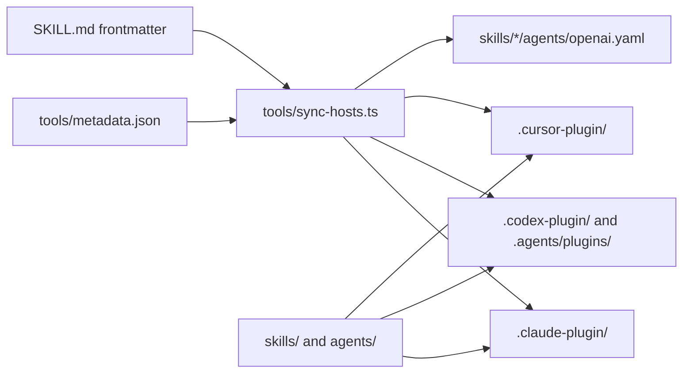

# CStack

This is a portable engineering toolkit for coding agents. It runs the same workflows in Claude Code, Codex, Cursor, and Intent: investigate, design, build, verify, and review. It builds on [PStack by Lauren Tan (poteto)](https://github.com/cursor/plugins/tree/main/pstack).

The toolkit holds process only. It has nothing about who uses it or which repositories they work in. Keep personal context in your agent's own memory.

## Install

Run one command from a terminal. Replace `OWNER/REPO` with the GitHub repository you install from:

```bash
npx -y github:OWNER/REPO
```

The command detects Intent, Claude Code, Codex, and Cursor and asks which hosts to install or update. Hosts that already have the plugin are selected by default. Enter a comma-separated list, such as `intent,claude,codex`, or `none`. The final table shows which hosts are present, which have the plugin, the versions before and after, and any next action.

To update installed hosts without the question:

```bash
npx -y github:OWNER/REPO --yes
```

Without a terminal, the command updates installed hosts only. To choose hosts explicitly or inspect the plan without changes:

```bash
npx -y github:OWNER/REPO --hosts intent,claude,codex
npx -y github:OWNER/REPO --report-only
```

Claude Code and Codex use their own plugin commands. Updates follow each host's configured source. A fresh install or a Codex copy registered from a local folder uses a best-effort read of the GitHub source from npx's adjacent package lockfile. If that file is missing or has an unsupported shape, no source is inferred.

The command announces a Codex move before it unregisters the local marketplace and adds the GitHub one. Report-only mode also says when a move would be needed. `--source OWNER/REPO` overrides the inferred source for operations that need one. Without a source, other updates continue and the table gives the command to retry.

The table compares installed copies, versions, and available sources before and after the run. An unchanged copy says it is already current and needs no session action. For an updated copy, new sessions use the new version. Sessions already open keep the old version until you start them again.

Each host command has a hard two-minute limit. Use `--timeout-ms MS` to change it. A timeout or failure keeps the available command output and the native command to retry in that host's result, then continues with the other hosts.

Cursor's CLI can add or refresh a marketplace. To install or finish an update, open **Customize**, find the plugin, and select **Install** or update. The command reports native Cursor installation and version as unknown because its CLI has no installed-plugin list. It also detects enabled user plugins that Cursor imports from Claude Code and updates those through Claude Code. The final table labels their versions as Claude imports.

Intent keeps the fetched package in `~/.local/share/cstack` and its host record beside it at `~/.local/share/cstack-install-record.json`. Both use `XDG_DATA_HOME` when set. Every fetched-package run replaces this whole plugin copy, including old files and local edits inside it. Keep personal work outside that folder. Replacement requires a regular metadata file that names this plugin. The installer refuses a copy path that overlaps your home, host folders, or record, including through parent links. The record governs only entries in your host folders. It stores a link's exact target or a file's content hash and permission bits. Updates replace or remove a host entry only when its current value matches the record. Your own host files and unrecorded broken links stay untouched. The table summarizes the entries it keeps. With a missing or unreadable record, the installer recognizes exact links to known skills from an earlier install and records them again. It removes no unproven host entry. The record stays outside the copy during replacement. A later run restores or completes an interrupted copy swap before host delivery and reports the recovery. Files are written beside their destinations before being renamed into place, so hard-linked backups keep their previous bytes and permissions.

On the first install Intent adds the mode rule at the top of your personal rule text under **Settings**, **Agent Behavior**. If it cannot reach Intent, it prints the rule to paste there. Updates leave that rule alone. The final table says where the rule went. Run `setup` to configure specialists and other settings. Installing does not create specialists.

A failure in one host does not stop the others. The command exits nonzero for command or inspection failures. Preserving your own file is a successful result. On a new computer, run the same command and select the hosts you want.

## Get started

Run `setup` once in each repository. It turns off AI attribution where your harness allows, fixes the commit identity, and makes the mode start in every session. Then run `cstack-mode` for an engineering task. Each harness has its own command form.

| Harness | Command |
| --- | --- |
| Claude Code | `/PLUGIN:cstack-mode` |
| Codex | `$PLUGIN:cstack-mode` |
| Cursor | `/cstack-mode` |

For example:

```text
Use cstack-mode to reproduce the invoice export bug, fix its cause,
and verify the exported amounts. Prepare a PR for review.
```

CStack Mode picks a playbook and loads the skills the task needs. It reports any tool or model the workflow needs that your harness lacks.

In Claude Code and Codex, the mode stays on for the project once you invoke it, including in new sessions and after the context compacts. Run the same command with `off` to turn it off. Codex asks you to review and trust the plugin's hooks first. In Cursor, it stays on in new chats, but can lapse when a long chat compacts. To keep it on every turn, pick `cstack-mode` from the `/` menu with Option+Enter on Mac or Alt+Enter on Windows instead of Enter. That makes it a [Custom Mode](https://cursor.com/docs/agent/prompting#custom-modes), which stays in context until you exit it. Cursor offers Custom Modes in the Agents Window and the CLI.

To turn the mode on in every project, set `CSTACK_MODE=on` in the environment your harness starts from, such as your shell profile or a cloud environment's settings. Claude Code, Codex, and Cursor all read it when a session starts. In Intent, a Claude Code or Codex agent also reads it when you installed the plugin in that harness too. Unset it to stop. A project you turn off with the `off` command stays off either way. Intent's rule from its install step is a separate switch. It keeps the mode on in Intent with or without the variable, and neither unsetting the variable nor the `off` command removes it. To turn the mode off in Intent, also delete the rule's paragraph under Settings, Agent Behavior.

## Write a prompt

A prompt states what you want and how to tell when it is done. The playbook supplies the steps, so a few plain sentences work better than a step-by-step plan. Put in:

- **The goal.** Say what is wrong, or what you want.
- **The done check.** Name something that can pass or fail. "Make it better" and "work on it for an hour" are not checks.
- **The proof to show.** Ask for the real command output, a video of the flow, the stored value, or a before and after number.
- **What you already know.** Add a symptom, a repro step, a log line, or a link.
- **The real constraints.** "Reproduce it first", "don't change any code yet", "no behavior change", and "let me review the design first" each change what the agent does.

Leave out the how and the list of skills. The playbook picks both, and a hand-written order drops steps it would keep. Hold back your theory of the cause until the agent restates the problem, because a stated guess narrows its search. For a long thread or a vague report, make the restatement the first step:

```text
Use cstack-mode to read this thread and restate the underlying issue
in plain words. Don't change any code yet.
```

For a change you will leave running, the `align` skill asks you for the goal, the done check, and the proof, and records them in a signed spec. Before you step away, say so, for example "going to bed". The agent then keeps going, and it still pauses before irreversible steps such as a deploy or a force-push.

## Learn from every PR

An agent marks a PR ready as soon as independent agent review and end-to-end verification pass. CI and the retro do not hold readiness. A failing check is fixed while the PR stays ready. Merging stays with a person unless a `Merging: auto` line asks agents to arm auto-merge.

After marking ready, the builder writes a recap with the `reflect` skill. Lessons for your repository go to its `AGENTS.md`, and lessons for the plugin go to a draft for the plugin's repository. The lessons land in one PR that goes through the same review and merge rules as any other PR. A PR with nothing to learn gets a `Retro: no lessons` comment.

On GitHub, the optional `Retro` status reports the recap and passes even when no recap exists. To update an older retro gate, ask an agent to replace it with the plugin's current reporter. The recap never blocks readiness or merging.

## Keep yourself the only author

The plugin's PR playbook writes commits, PRs, and comments with no AI attribution, and it checks that you are the commit author. Each harness also adds its own attribution, which you turn off on your computer:

| Harness | Setting |
| --- | --- |
| Claude Code | In `~/.claude/settings.json`: `"attribution": { "commit": "", "pr": "", "sessionUrl": false }` |
| Codex | None needed. Current versions add no attribution. |
| Cursor | Turn off Commit Attribution and PR Attribution in Cursor Settings. For the CLI, in `~/.cursor/cli-config.json`: `"attribution": { "attributeCommitsToAgent": false, "attributePRsToAgent": false }` |

Cloud agents (Claude Code on the web, Codex cloud tasks, Cursor cloud agents) can add attribution that no setting removes, such as a bot commit identity or a comment footer.

## Choose a skill

| Task | Skill |
| --- | --- |
| Run an engineering task from investigation through verification | `cstack-mode` |
| Explain how existing code works | `how` |
| Investigate why a decision was made | `why` |
| Agree a signed spec with the agent before it works alone | `align` |
| Compare designs before implementation | `architect` |
| Stress-test a plan and record its glossary and decisions | `grill-with-docs` |
| Show a design or change as code, diffs, or diagrams | `show-me` |
| Review a change | `interrogate` |
| Build with a failing test first | `tdd` |
| Design or polish a UI and prove every state renders | `design-ui` |
| Drive a UI or CLI to verify a change | `control-ui`, `control-cli` |
| Check a benchmark result before you trust it | `benchmark-checklist` |
| Coordinate independent tasks | `swarm` |
| Write clear prose for people | `simple-as-prose` |
| Write prompts, skills, and agent instructions | `writing-for-agents` |
| Capture lessons from a session or a PR you just finished | `reflect` |
| Stop agents repeating the same mistake | `correct` |

The [skill directory](skills/) has the full catalog. Playbooks, principles, persona prompts, and references are instructions the agent loads as needed. This README is the repository's only human guide.

Some workflows need extra tools. The Bun helpers need their locked dependencies, the PR watcher needs `gh`, and the Orchestrate stack frontier needs Graphite.

## How the repository is laid out

One core serves every harness. Each harness that loads plugins gets a thin adapter that uses its own native plugin format.



| Path | Role |
| --- | --- |
| `skills/` | The core. Skills in the shared `SKILL.md` format, with no harness tool names. |
| `agents/` | Persona prompts. Claude Code and Cursor register them as subagents. Codex receives them as instructions. Intent lists them as specialists. |
| `skills/cstack-mode/references/runtime.md` | The runtime contract. Workflows name capabilities such as "delegate" and "ask the user". |
| `skills/cstack-mode/references/hosts/` | One host note per harness. Each maps those capabilities to native tools. |
| `.claude-plugin/`, `.codex-plugin/`, `.agents/plugins/`, `.cursor-plugin/` | Generated manifests. Never edit them by hand. |
| `hooks/` | Hooks that keep `cstack-mode` on across sessions. Claude Code and Codex load `hooks/hooks.json`, and Cursor loads `hooks/cursor.json`. `intent-install.sh` links the plugin into Intent and is the command `npx` runs. Inside Intent, Claude Code and Codex still load `hooks/hooks.json` from their own copy of the plugin. |
| `tools/metadata.json` | The single source for the plugin's name, version, and description. |
| `contrib/` | Optional sources that need one vendor's automation APIs. No manifest loads them. |

The release workflow sets the version after each merge to main. To rename the plugin, also rename the `<name>-mode` skill and the `<name>-agent` persona to match, then regenerate. The agent's skill list shows every workflow skill. The `principle-*` skills set `disable-model-invocation: true`, which keeps them off that list. `cstack-mode` reads them when a step needs one. CI fails if a principle is visible or any other skill is hidden.

```bash
bun run --cwd skills/cstack-mode/scripts sync:hosts
```

## Develop and verify

Tooling uses Bun and strict, erasable TypeScript. The versions are pinned in [package.json](skills/cstack-mode/scripts/package.json) and the dependency lockfile.

With the pinned Bun runtime available, run these commands from a checkout:

```bash
bun install --cwd skills/cstack-mode/scripts --frozen-lockfile --ignore-scripts
bun run --cwd skills/cstack-mode/scripts typecheck
bun run --cwd skills/cstack-mode/scripts check:hosts
bun run --cwd skills/cstack-mode/scripts test
```

`check:hosts` fails when a generated manifest or `openai.yaml` no longer matches its source. GitHub Actions runs all of these on pull requests and pushes to main. The tests are grouped by what they exercise.

| Location | Category | Execution |
| --- | --- | --- |
| `tests/unit/` | The watcher through `main`, with a fake GitHub reader and a fake clock | `test:unit` |
| `tests/integration/` | Real CLI processes, filesystem stores, Git worktrees, and bundled resource links | `test:integration` |
| `tests/types/` | Compiler checks for valid and invalid watcher states | `typecheck` |
| `tests/support/` | Shared test fixtures | Loaded by tests |
| `tests/e2e/` | Real Codex plugin discovery and installation lifecycle in an isolated home | Explicitly authorized `test:e2e` run |

`test` runs the unit and integration suites. The end-to-end harness is a standalone command because it needs a Codex executable and permission to install the candidate. Automatic CI skips it.

For a Linux x86_64 cloud environment with Node and npm available, use `bash tools/setup.sh` as the install script. It installs the pinned Bun runtime into `/workspace/.plugin-tools`, installs locked dependencies, and runs the checks. Add `/workspace/.plugin-tools/bin` to the environment PATH. Set `SETUP_TOOL_ROOT` to install somewhere else.

Plugin discovery can also be tested in a disposable, credential-free home. After explicit authorization to install the candidate for that test, run:

```bash
bun run --cwd skills/cstack-mode/scripts test:e2e --allow-isolated-install --codex <binary>
```

The flag guards the command; it does not grant permission. Verify host-specific behavior in each harness where you intend to use the plugin.

## PStack updates

PStack updates arrive through reviewed, agent-assisted imports. An agent compares upstream changes with the recorded baseline, adapts useful changes to the harness-neutral core, and verifies the result in a PR. The plugin can change upstream structure and behavior to suit its own design.

The imported baseline is PStack 0.15.13 at `cursor/plugins@2cbf58508f40de470d7490b55c51d71241928fa2`. The update from 0.15.9 took the guide's advice on writing a prompt and Cursor's Custom Modes for keeping the mode on. It left out the `poteto-help` skill, because in a pilot the plugin's agent already answered help questions well from the installed skill files, and a typed-only skill would break the rule that hides only principle skills. It also left out the guide pages, because this README is the repository's only human guide. Of the guide's advice, it left out cloud subagents and `/in-cloud`, Cursor Projects, typing `/typescript-best-practices`, and traits for an agent-friendly control CLI. The update from 0.15.5 took `correct`, `benchmark-checklist`, `principle-explain-the-number`, and the agent-friendly `architect` red flags. It left out the performance mantras, the PR heading rewrite, `/goal` and `/loop` scheduling, fresh subagents by default, the rule against reply tokens, and the removal of source lines from `technical-writing`. A later pass took 0.15.6's `typescript-best-practices` change without making zod the only answer. Its cast example now builds the value from checked fields, and a schema that must match an existing type is annotated with it. The original import of 0.15.5 remains in Git history at `c31f7ace991843f5576398ad025969465251192c`.

## License

[MIT](LICENSE). Upstream license notices and source provenance remain with the imported material. `align`, `grill-with-docs`, and `domain-modeling` adapt [mattpocock/skills](https://github.com/mattpocock/skills), `show-me` adapts [humanlayer/skills](https://github.com/humanlayer/skills), and `deslop`, `control-ui`, and `control-cli` adapt [Cursor Team Kit](https://github.com/cursor/plugins/tree/main/cursor-team-kit). Each keeps its upstream MIT license and an `origin.json` beside its `SKILL.md`.
