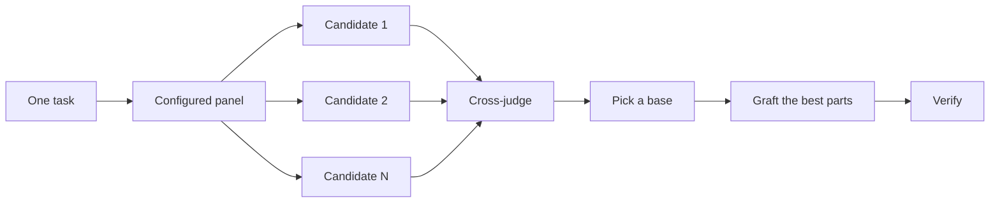

# Design before you write code

> Development port: see [verified support and remaining runtime gates](../codex-port/VALIDATION.md). Examples are workflow guidance; unverified persistence or automation is not a release claim.

One attempt at a hard design locks in the first shape the model thought of. `$cstack:architect` settles types and boundaries before implementation. `$cstack:arena` runs several attempts at the same brief and merges the best parts. `$cstack:interrogate` has other models try to break the result. When the job is coverage rather than design synthesis, `$cstack:swarm` fans out slices or races and aggregates their results.


## Settle the shape with `$cstack:architect`

```text
$cstack:architect design the import pipeline before writing any code. i care most about how callers use it.
```

[`$cstack:architect`](../../skills/architect/SKILL.md) grounds itself first, running `$cstack:how` over the code the design touches and `$cstack:why` when it moves ownership or layers. Then it runs `$cstack:arena` to produce competing design sketches, with the caller's usage written first in each, followed by types, signatures, and a module map.

By default it proceeds straight from the synthesized design into implementation. If you want to see the design first, say so:

```text
$cstack:architect with checkpoint. stop and show me before implementing.
```

## Fan out attempts with `$cstack:arena`

```text
$cstack:arena take my prompt to the arena verbatim. i want to compare their proposals with yours.
```

[`$cstack:arena`](../../skills/arena/SKILL.md) is the general tool underneath. N subagents attempt the same design or code brief in parallel, each writing to its own worktree or directory. A read-only judge, on a different model family when your configuration allows one, scores every candidate against a rubric. The coordinator reads each candidate end to end, picks a base, grafts in the best ideas from the losers, and verifies the result.



The panel comes from your [`$cstack:setup-pstack`](../../skills/setup-pstack/SKILL.md) configuration, and you can adjust it per task. Ask for more candidates when the decision matters, fewer when it doesn't:

```text
$cstack:arena this, 5 candidates. the cache key format is expensive to change later.
```

## Cover slices and races with `$cstack:swarm`

```text
$cstack:swarm check every package under packages/ against its check.sh. one worker per package. one report.
```

[`$cstack:swarm`](../../skills/swarm/SKILL.md) fans N workers across independent slices, coverage matrices, gauntlet lanes, exploration partitions, or declared race arms. Each worker gets its own scope and check, then reports `PASS`, `ISSUES`, or `BLOCKED`. The parent waits for the workers and returns one compact report with any gaps or dropouts.

Reach for it when parallelism buys coverage or lets independent checks race. `$cstack:arena` gives every worker the same design or code brief, then picks a base and grafts the best parts. `$cstack:swarm` covers slices or runs a race with a selection rule declared up front. It does not use the base-selection and grafting ceremony.

## Break it with `$cstack:interrogate`

```text
$cstack:interrogate the whole branch, but skeptically. no nitpicks unless it's an actual bug or regression.
```

[`$cstack:interrogate`](../../skills/interrogate/SKILL.md) sends the same diff, intent, and rubric to several reviewers on different model families. Model diversity is the point. Different models have different blind spots, so a finding two models raise independently is high-confidence signal. The lead sorts everything into `Act on`, `Consider`, `Noted`, and `Dismissed`, with a reason for each dismissal, and applies nothing automatically.

Read the dismissals too. The lead is a pragmatic senior engineer, not an oracle, and you can override it.

## How much design work does a task deserve?

You might be wondering whether every change needs this. No. Most changes need none of it. A rough ladder:

- A small, finished change you're unsure about needs `$cstack:interrogate` alone.
- A change that crosses function boundaries or moves ownership earns `$cstack:architect`, which brings `$cstack:arena` with it.
- A standalone decision where independent attempts would help, like naming, formats, or an algorithm, is `$cstack:arena` directly.
- A coverage matrix, set of parallel checks, or race with declared arms is `$cstack:swarm`.
- A contested design that's expensive to reverse gets `$cstack:architect`, then `$cstack:interrogate` before shipping.

`$cstack:poteto-mode` already applies this ladder. Boundary-crossing work triggers `$cstack:architect` on its own, so you reach for these directly mainly when you want more or less scrutiny than the default.

Next: [Build and clean the change](./05-build-and-clean.md).
